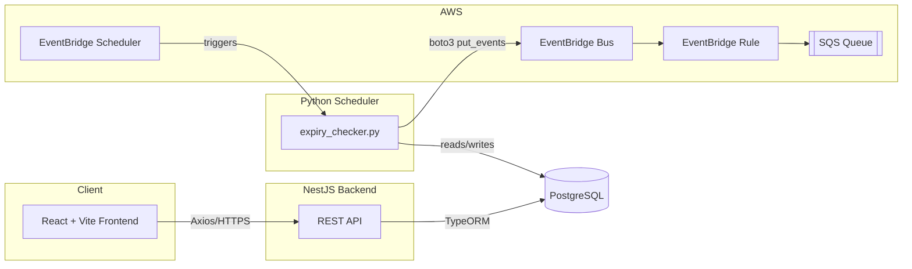

# Employee Compliance Tracking System

A full-stack system that tracks employee compliance items — **visas,
certifications, background checks, training renewals, and work permits** —
so that a compliance record never silently expires. A scheduled job
recomputes status daily and publishes lifecycle events to AWS so downstream
systems (email, Slack, audit logs) can act on them, without ever sending a
duplicate notification.

## Technology Stack

| Layer | Stack |
|---|---|
| Backend | NestJS, TypeScript, TypeORM, PostgreSQL, Swagger |
| Frontend | React, Vite, TypeScript, Tailwind CSS, Axios, React Router, Recharts |
| Scheduler | Python 3.12, boto3, psycopg2 |
| Cloud | AWS EventBridge, AWS SQS |

No Docker is used anywhere in this project — every piece runs directly on
the host (Node, Python, and a local/managed PostgreSQL instance).

---

## Project Structure

```
Employee Compliance Tracking System/
├── backend/        NestJS API (employees, compliance records, dashboard)
├── frontend/        React + Vite SPA
├── scheduler/        Python expiry checker + EventBridge publisher
├── database/        Raw SQL schema + seed data
├── docs/             Architecture diagram, AWS setup walkthrough
└── README.md          You are here
```

---

## Architecture



Full component breakdown and rationale: [`docs/architecture.md`](docs/architecture.md).
AWS resource creation, step by step: [`docs/aws-setup.md`](docs/aws-setup.md).

---

## Database Schema

Two tables — see [`database/schema.sql`](database/schema.sql) for the
authoritative DDL (enums, indexes, constraints, triggers).

**`employees`**

| Column | Type | Notes |
|---|---|---|
| id | UUID PK | |
| employee_code | varchar(50) | unique |
| first_name / last_name | varchar(100) | |
| email | varchar(255) | unique |
| department | varchar(100) | |
| created_at / updated_at | timestamptz | |
| deleted_at | timestamptz | soft delete (see [Design Decisions](#soft-delete-justification)) |

**`compliance_records`**

| Column | Type | Notes |
|---|---|---|
| id | UUID PK | |
| employee_id | UUID FK → employees.id | |
| compliance_type | enum | Visa, Certification, Background Check, Training, Work Permit |
| issued_date | date | |
| expiry_date | date | `CHECK (expiry_date > issued_date)` |
| status | enum | ACTIVE, EXPIRING_SOON, EXPIRED, RENEWED |
| document_url | varchar(1000) | nullable |
| notes | text | nullable |
| expiring_notification_sent | boolean | idempotency guard |
| expired_notification_sent | boolean | idempotency guard |
| created_at / updated_at / deleted_at | timestamptz | soft delete |

---

## Setup Instructions

### 1. PostgreSQL Setup

Install PostgreSQL 14+ locally (or use a managed instance — RDS free tier
works fine). Then:

```bash
createdb compliance_tracker
psql -d compliance_tracker -f database/schema.sql
psql -d compliance_tracker -f database/seed.sql   # optional sample data
```

Alternatively, skip `schema.sql` entirely and let TypeORM create the schema
for you in development by setting `DB_SYNCHRONIZE=true` in `backend/.env`
(see [Reporting Strategy](#reporting-strategy) note on `synchronize` below —
don't use it against a database you also apply `schema.sql` to, pick one).

### 2. AWS Setup

See [`docs/aws-setup.md`](docs/aws-setup.md) for the full walkthrough
(EventBridge bus, EventBridge rule, SQS queue, IAM policy, all via AWS CLI,
all Free Tier). Short version:

1. (Optional) Create a custom EventBridge bus, or use the account's
   `default` bus — either works, see note below.
2. Create an SQS queue and grant EventBridge `sqs:SendMessage` on it via a
   queue policy scoped to the specific rule's ARN.
3. Create an EventBridge rule on that bus matching the `source` value the
   scheduler publishes with (`EVENT_SOURCE` in `scheduler/.env`), targeting
   the queue.
4. Give the scheduler's AWS credentials `events:PutEvents` on the bus.

None of these resource names are fixed by the code — `EVENT_BUS_NAME` and
`EVENT_SOURCE` in `scheduler/.env` are what actually control what the
scheduler publishes to/as; whatever you name the bus, queue, and rule in
AWS just has to match those two values and the rule's event pattern.

**Custom bus vs. default bus**: `docs/aws-setup.md` walks through creating
a dedicated `compliance-tracker-bus` to keep this app's events isolated
from anything else in the account — the cleaner choice for a real
deployment. Publishing to the account's `default` bus instead also works
identically (this was verified end-to-end against a `default`-bus setup)
and is one line less setup for a demo/free-tier account — use whichever
fits; nothing in the backend, frontend, or scheduler code assumes one over
the other.

No AWS account IDs, ARNs, or credentials are hardcoded anywhere in this
repo — every identifier is an environment variable, resolved at setup or
runtime.

### 3. Running the Backend

```bash
cd backend
npm install
cp .env.example .env      # fill in your DB connection details
npm run start:dev
```

- API: `http://localhost:3000`
- Swagger docs: `http://localhost:3000/api/docs`

### 4. Running the Frontend

```bash
cd frontend
npm install
cp .env.example .env      # VITE_API_URL, defaults to http://localhost:3000
npm run dev
```

- App: `http://localhost:5173`

### 5. Running the Scheduler

```bash
cd scheduler
python -m venv .venv
source .venv/bin/activate   # Windows: .venv\Scripts\activate
pip install -r requirements.txt
cp .env.example .env        # DB connection + EVENT_BUS_NAME + AWS_REGION
python expiry_checker.py
```

Run it manually for a demo, on a cron schedule, or deploy `lambda_handler`
behind an EventBridge Scheduler rule — see
[`docs/aws-setup.md`](docs/aws-setup.md#6-scheduling-the-checker-itself).

---

## API Documentation

Full interactive docs are generated by Swagger at `/api/docs` once the
backend is running. Summary:

**Employees**

| Method | Path | Notes |
|---|---|---|
| POST | `/employees` | |
| GET | `/employees` | `?department=&search=&page=&limit=` |
| GET | `/employees/:id` | |
| PATCH | `/employees/:id` | |
| DELETE | `/employees/:id` | soft delete |

**Compliance Records**

| Method | Path | Notes |
|---|---|---|
| POST | `/compliance-records` | |
| GET | `/compliance-records` | `?employeeId=&status=&department=&complianceType=&page=&limit=` |
| GET | `/compliance-records/:id` | |
| PATCH | `/compliance-records/:id` | |
| DELETE | `/compliance-records/:id` | soft delete |

**Dashboard**

| Method | Path | Notes |
|---|---|---|
| GET | `/dashboard/summary` | `{ total, active, expiringSoon, expired }` |
| GET | `/dashboard/by-department` | counts grouped by department |
| GET | `/dashboard/by-type` | counts grouped by compliance type |
| GET | `/dashboard/upcoming` | `?days=30` or `?startDate=&endDate=` |

---

## Assumptions

- A single organization/tenant — no multi-tenancy or auth layer was
  requested, so none is implemented. Adding auth would sit in front of the
  existing controllers via a NestJS guard without touching business logic.
- `employees.deleted_at` was added even though the spec's field list for the
  Employees table didn't include it, because `compliance_records.employee_id`
  has a foreign key to it — hard-deleting an employee would cascade-delete
  (or orphan) their compliance history, which conflicts with "compliance
  records never silently expire." Soft delete on both tables keeps that
  guarantee.
- "Load all active records" in the scheduler spec is read as "all records
  under automatic lifecycle management" — i.e. everything except
  soft-deleted rows and rows a human has manually marked `RENEWED` (a
  terminal state until the next PATCH resets it), not literally only rows
  whose `status` already equals `ACTIVE`.
- `EXPIRING_SOON` threshold is a fixed 30-day window (per the spec), exposed
  as `EXPIRING_SOON_THRESHOLD_DAYS` in the scheduler's env and mirrored as
  the default for `/dashboard/upcoming?days=`.

## Design Decisions

- **DTO + class-validator on every write endpoint**, with a global
  `ValidationPipe({ whitelist: true, forbidNonWhitelisted: true, transform: true })`
  — invalid or unexpected fields are rejected before they reach a service.
- **`expiryDate > issuedDate`** is enforced twice: a custom `@IsAfterDate`
  class-validator decorator for immediate per-field feedback, and again in
  `ComplianceRecordsService` against the *final* merged state on PATCH
  (where only one of the two dates might be present in the request body).
- **Status is server-computed on create**, from `expiryDate` vs. today —
  clients don't get to set an inconsistent initial status. A manual `status`
  override is allowed only on PATCH (e.g. marking `RENEWED`), and doing so
  resets both notification flags so the next lifecycle produces fresh
  notifications.
- **Filtering by department** on compliance records joins through
  `employee.department` rather than duplicating department onto every
  compliance record — department is an employee attribute, not a compliance
  one.

### Soft Delete Justification

Both tables use `deleted_at` instead of hard deletes:

1. **Audit trail** — compliance history (who was checked, when, what
   expired) is exactly the kind of record a compliance system should never
   let silently disappear, including when an employee record itself is
   removed.
2. **Referential safety** — `compliance_records.employee_id` is a real FK;
   soft-deleting employees avoids a cascade that would destroy compliance
   history the moment HR removes an employee record.
3. **Reversibility** — deletions in this domain are almost always
   corrections ("wrong employee code entered") rather than intent to
   permanently destroy data; soft delete makes that recoverable at the DB
   layer without extra tooling.

TypeORM's `@DeleteDateColumn()` + `softRemove()` handles this: default
`find`/`findOne` queries automatically exclude soft-deleted rows.

### Idempotency Strategy

The scheduler (`scheduler/expiry_checker.py`) can be run any number of
times — hourly, daily, or replayed after a failure — without producing
duplicate `COMPLIANCE_EXPIRING_SOON` / `COMPLIANCE_EXPIRED` events. The
guard is **not** "did the status change during this run" (which breaks the
moment you re-run against unchanged data) but two persisted booleans per
record:

- `expiring_notification_sent`
- `expired_notification_sent`

Each run recomputes the record's *correct* status from `expiry_date` vs.
today, and only publishes an event for a transition whose flag is still
`false`:

```
ACTIVE → EXPIRING_SOON   → publish COMPLIANCE_EXPIRING_SOON once, then expiring_notification_sent = true
EXPIRING_SOON → EXPIRED  → publish COMPLIANCE_EXPIRED once, then expired_notification_sent = true
```

A flag is only flipped to `true` **after** a successful EventBridge
`put_events` call — if the publish throws, the flag stays `false` and the
next run retries it, so failures fail toward "notify again" rather than
"silently drop." Because the underlying transition (issued → expires) is
monotonic — a record only ever moves forward through
ACTIVE → EXPIRING_SOON → EXPIRED as time passes, never backward on its own —
each flag only needs to be set once per record's lifetime. The only way a
record re-enters the pipeline is a human editing its `expiryDate` or
manually setting `status = RENEWED` via `PATCH /compliance-records/:id`,
both of which explicitly reset both flags in `compliance-records.service.ts`
— which is exactly when a *new* round of notifications should become
possible again.

### Reporting Strategy

The Dashboard module (`GET /dashboard/summary|by-department|by-type|upcoming`)
computes every aggregate **live**, on read, directly against
`compliance_records` (grouped `COUNT(*)` queries via TypeORM's query
builder) — no pre-aggregated summary table, materialized view, or
scheduled roll-up job.

**Why live-computed over pre-aggregated:**

- **Correctness over staleness.** The entire point of this system is that a
  compliance record never *silently* expires. A pre-aggregated dashboard
  that only refreshes once a day would show yesterday's counts for hours at
  a time — directly undermining the product's core promise the moment
  someone creates, edits, or deletes a record between refreshes.
- **Data volume doesn't demand it.** Compliance records are bounded by
  headcount × compliance-item-types — even a large enterprise is looking at
  tens of thousands of rows, not billions of events. Simple indexed
  `GROUP BY` queries (see `idx_compliance_records_status`,
  `idx_compliance_records_type`, `idx_compliance_records_expiry_date` in
  `database/schema.sql`) stay fast at that scale without pre-aggregation.
- **Simplicity.** No second write path to keep in sync, no cache
  invalidation problem, no "the dashboard and the records table disagree"
  class of bug. The scheduler already owns recomputing `status`; the
  dashboard just counts whatever `status` currently says.
- **Trade-off acknowledged.** If this were scaled to millions of records
  with sub-100ms dashboard SLAs, a pre-aggregated or cached read model would
  become the right call — but that's a scale problem this system doesn't
  have yet, and building for it now would be premature.

---

## Seed Data

`database/seed.sql` inserts 10 employees and 20 compliance records spanning
all four statuses (8 ACTIVE, 6 EXPIRING_SOON, 4 EXPIRED, 2 RENEWED), with
dates computed relative to `CURRENT_DATE` so the demo stays meaningful
regardless of when it's loaded. Notification flags start `false`, so
running the scheduler against freshly-seeded data demonstrates the full
notification flow from a clean state.
