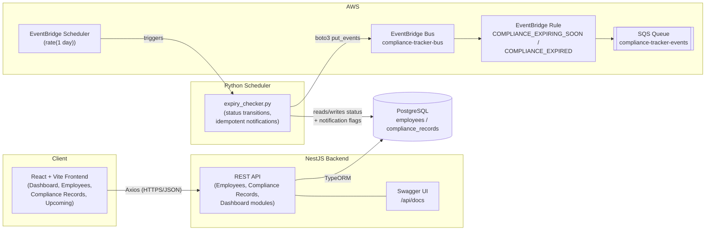

# Architecture

## Components

| Component | Responsibility |
|---|---|
| **Frontend** (React/Vite/Tailwind) | CRUD UI for employees & compliance records, dashboard charts, upcoming-expirations view. Talks only to the NestJS API over HTTP. |
| **Backend** (NestJS/TypeORM) | Owns validation, business rules (soft delete, status enum, date ordering), pagination/filtering, and live-computed dashboard aggregates. Sole writer to PostgreSQL. |
| **PostgreSQL** | System of record for employees and compliance records. Soft-deleted rows are retained (`deleted_at`), never physically removed by the app. |
| **Python scheduler** | Runs independently of the API (own DB connection), recomputes status daily, and is the only component that publishes to EventBridge. |
| **EventBridge + SQS** | Decouples "a compliance item changed lifecycle stage" from "something needs to act on it" (email, Slack, audit log, etc.) — consumers subscribe to the queue without the scheduler knowing they exist. |

## Why the scheduler talks to Postgres directly instead of through the API

The scheduler is a batch job over the *entire* table, not a handful of
user-driven writes — going through HTTP would mean paginating through every
record on every run for no benefit, since the scheduler and API share the
same trust boundary (same VPC/network, same database credentials scope) and
the same business rules the API enforces (soft delete, status enum) are
re-implemented directly in `scheduler/db.py` where they're actually needed.
